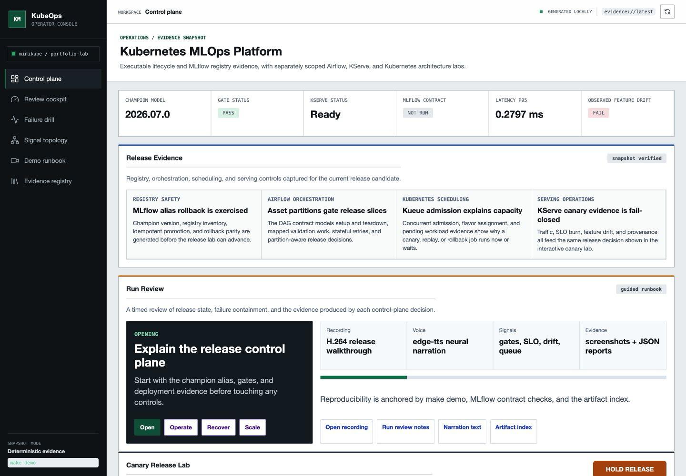
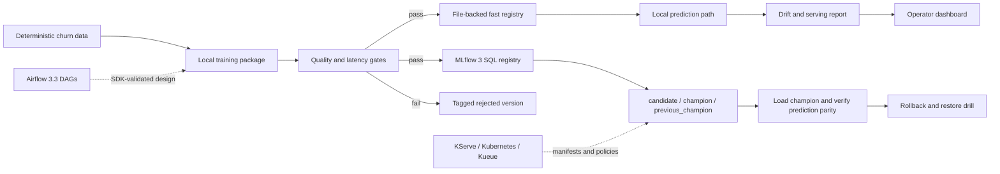
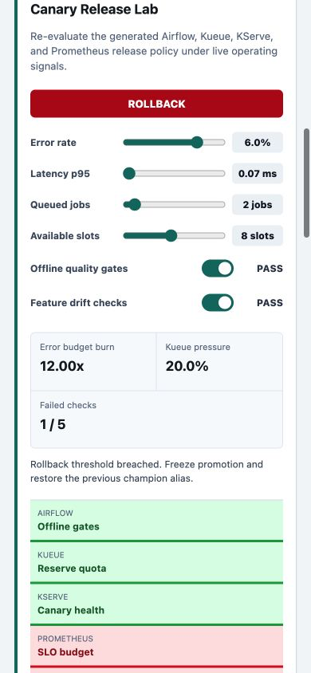
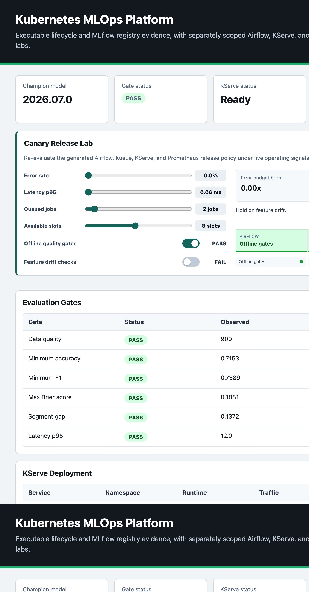
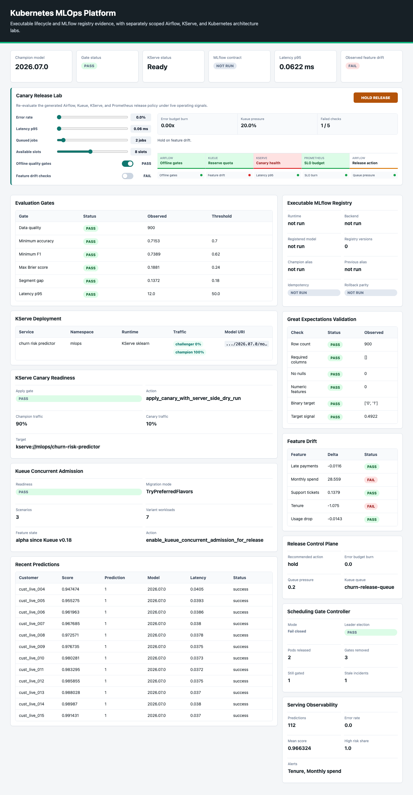
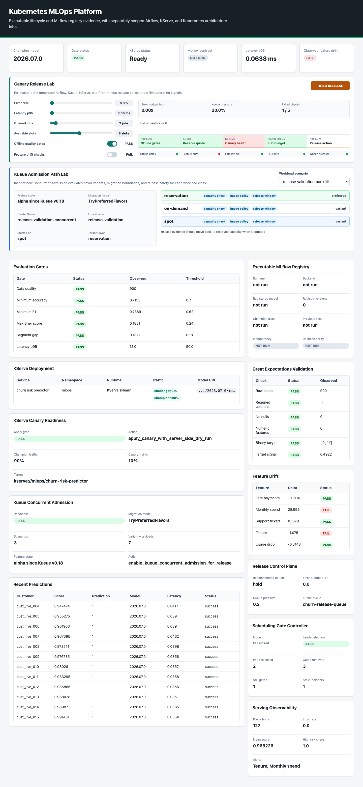

# Kubernetes-Native MLOps Platform

[](https://github.com/kevinmeix1/advanced-kubernetes-mlops-platform/actions/workflows/ci.yml)

A local-first model lifecycle and release-control portfolio project. The fast
path demonstrates deterministic training, evaluation gates, promotion,
prediction, monitoring, and rollback. A separate integration path exercises a
real MLflow 3 registry with SQL metadata, model signatures, dataset lineage,
aliases, and loaded-model parity.

This is a production-style engineering project, not a production platform. The
Kubernetes, KServe, Kueue, Airflow, and GitOps assets are architecture labs
unless the implementation matrix below says they are executed.



[Watch the narrated judge demo](docs/demo/kubernetes-mlops-judge-demo.mp4) | [Follow the live demo script](docs/judge-demo.md)

## Implementation Status

| Capability | Evidence | Status |
| --- | --- | --- |
| Deterministic lifecycle | `make demo`, dependency-light domain tests | Executable locally and in CI |
| MLflow registry | `make mlflow-contract`, MLflow 3.14 integration test | Executable against SQLite or an HTTP tracking server |
| Containerized MLflow | `make compose-smoke` | Executed in GitHub Actions; Docker is unavailable on the development host |
| Airflow orchestration | Airflow 3.3 SDK parse contract | DAGs parse against the real constrained SDK; no scheduler is deployed |
| Interactive canary release lab | Browser-tested hold, advance, and rollback policy transitions | Executable locally |
| KServe canary readiness | Server-Side Apply dry-run plan, field-manager ownership, and Argo analysis gates | Generated evidence; cluster apply is operator-run |
| Kueue Concurrent Admission | Parent and Variant Workload evidence, `TryPreferredFlavors`, and flavor-scoped checks | Generated evidence; alpha feature gate is explicit |
| KServe and Kubernetes | Manifests, policy tests, planning reports | Architecture lab; no cluster reconciliation claim |
| Minikube | Documented bootstrap and apply commands | Operator-run path, not part of CI evidence |

Starting a service is not treated as integration evidence. The MLflow Compose
path only counts because CI logs models through HTTP, moves aliases, loads the
champion, exercises rollback, and checks the server's metrics endpoint.

## Architecture



Solid lines are executable. Dashed lines are validated architecture assets,
not a claim that a Kubernetes control plane is running.

## Quick Start

The dependency-light path uses the standard library:

```bash
make clean
make demo
make test
open .local/reports/mlops_platform_dashboard.html
```

The Canary Release Lab begins on HOLD because the generated monitoring report
contains observed feature drift. Mark the scenario drift check healthy to move
all five controls to ADVANCE CANARY, then raise error rate to 6% to produce a
12x error-budget burn and an explicit ROLLBACK. These browser decisions use the
same emitted thresholds as the Python release-policy evaluator.



The dashboard also includes a KServe canary readiness panel for server-side
apply dry-run, field-manager ownership, and Argo analysis evidence.



It also includes a Kueue Concurrent Admission panel that summarizes preferred
flavor migration, Parent/Variant Workload evidence, and alpha feature-gate
guardrails. See [Kueue Concurrent Admission](docs/kueue-concurrent-admission.md).



Mobile capture: [dashboard-concurrent-admission-mobile.png](docs/screenshots/dashboard-concurrent-admission-mobile.png)

The Kueue Admission Path Lab lets reviewers switch workload scenarios and see
preferred flavors, last-acceptable flavor boundaries, and flavor-scoped checks
without reading the manifest first.



Mobile capture: [dashboard-admission-path-lab-mobile.png](docs/screenshots/dashboard-admission-path-lab-mobile.png)

The real MLflow path uses an isolated environment:

```bash
python3.12 -m venv .venv-mlflow
.venv-mlflow/bin/python -m pip install --upgrade pip==25.3
.venv-mlflow/bin/python -m pip install \
  --constraint requirements-mlflow.lock \
  -e ".[mlflow3]" "ruff==0.15.21"
make mlflow-contract PYTHON=.venv-mlflow/bin/python
make test-mlflow PYTHON=.venv-mlflow/bin/python
```

The contract writes:

- `.local/mlflow/mlflow.db`
- `.local/mlflow/artifacts/`
- `.local/reports/mlflow_registry_contract.json`
- `.local/reports/mlops_platform_dashboard.html`

## MLflow Registry Contract

The integration path uses current MLflow lifecycle primitives rather than
deprecated model stages:

- a database-backed tracking and registry store
- an explicitly named experiment and registered model
- model-from-code packaging instead of a pickled `PythonModel`
- required input/output signature validation
- training dataset digest and run-to-model metric linkage
- immutable application version, artifact digest, and gate digest tags
- idempotent registration replay for identical evidence
- conflict rejection when an application version is reused with different evidence
- gate-protected `candidate` alias assignment
- `champion` and `previous_champion` alias promotion
- loaded champion prediction parity against the local implementation
- behavioral rollback followed by restoration of the intended champion

`make mlflow-contract` registers two passing model versions trained from
different deterministic datasets and one rejected version. The rollback changes
the served score, proves parity for the previous model, then restores the newer
champion. Rerunning the command does not create duplicate versions.

## Container Path

```bash
make compose-config
make compose-smoke PYTHON=.venv-mlflow/bin/python
```

The Compose path uses:

- an explicit `mlflow db upgrade` finite migration job
- MLflow 3.14 with one worker over a SQLite backend
- proxied local artifact storage on a named volume
- DNS-rebinding and CORS allowlists
- a non-root process, read-only root filesystem, dropped capabilities, PID and resource limits
- MLflow's Prometheus endpoint, with an optional Prometheus profile
- an explicit exporter dependency and import preflight for that metrics endpoint
- a versioned metrics smoke report that checks MLflow's exporter identity instead of incidental process metrics

SQLite is deliberate for this single-node integration test. PostgreSQL and
object storage are the production migration, not hidden Compose dependencies.

## Promotion Semantics

The fast path and MLflow path enforce the same gate policy:

| Gate | Threshold |
| --- | ---: |
| Data validation | all blocking checks pass |
| Accuracy | `>= 0.70` |
| F1 | `>= 0.62` |
| Brier score | `<= 0.24` |
| Segment accuracy gap | `<= 0.18` |
| Prediction latency p95 | `<= 50 ms` |

Registration and promotion are separate operations. Failed candidates remain
auditable but cannot receive a deployable alias. Alias updates are idempotent,
and the contract preserves one previous champion for a deterministic rollback.

## Airflow Boundary

The Airflow 3.3 job installs Airflow with the official Python 3.11 constraints
and parses the release DAG against the real SDK. The repository demonstrates
task and asset state stores, bounded rollups, runtime partitions, and
exception-aware retries. It does not run a scheduler, metadata database, or
Kubernetes executor in CI.

## Kubernetes Scope

The repository contains substantial design assets for KServe, Kueue, KubeRay,
Dynamic Resource Allocation, workload identity, network policy, policy as code,
GitOps, SLOs, supply-chain evidence, and failure recovery. These assets support
architecture interviews and cluster migration planning. Manifest existence is
not runtime proof.

The first credible cluster milestone is intentionally narrow:

1. Deploy MLflow with PostgreSQL and object storage.
2. Publish the verified champion as an MLflow model artifact.
3. Render one KServe `InferenceService` from the champion alias.
4. validate it with server-side apply and a real prediction smoke test.
5. Reconcile observed KServe revision status back into release evidence.

## Commands

```bash
make demo                 # dependency-light lifecycle and architecture reports
make train                # deterministic training and file-backed run evidence
make evaluate             # blocking quality gates and local promotion
make deploy               # local KServe-shaped deployment state
make predict              # one prediction through the local champion
make monitor              # drift, latency, error, and throughput report
make rollback             # local file-backed rollback
make mlflow-contract      # real SQL registry, aliases, load, and rollback
make mlflow-metrics-contract # validate a running MLflow Prometheus endpoint
make test-mlflow          # MLflow integration regression test
make lint-mlflow          # Ruff on the executable integration boundary
make compose-smoke        # live HTTP MLflow server and metrics contract
make airflow-sdk-contract # parse DAGs against Airflow 3.3
make kserve-canary-readiness # server-side dry-run and canary analysis evidence
make scheduling-gate-controller # fail-closed Pod Scheduling Readiness controller evidence
make demo-voice           # generate natural neural narration in an isolated environment
make demo-video           # assemble the committed hold/advance/rollback walkthrough
make test                 # dependency-light suite
```

## Test Evidence

The MLflow integration proves:

1. models are packaged with model-from-code and an explicit signature
2. dataset digests and model-linked metrics are recorded
3. identical application versions replay without duplicate registry versions
4. changed evidence under the same application version is rejected
5. failed gates cannot promote a candidate
6. champion and previous-champion aliases move as documented
7. models loaded by alias produce the same score as the local implementation
8. rollback changes behavior and restoration returns the intended champion

The default suite keeps the MLflow test optional so reviewers can still run the
fast path without installing the integration environment.

## Production Boundary

- SQLite supports this single-node contract; multi-replica MLflow needs a managed relational database.
- Local artifacts support repeatability; production needs versioned object storage, retention, encryption, and backup controls.
- Compose configures network protections but not authentication; production needs SSO or basic-auth/RBAC behind TLS.
- Alias changes span multiple API calls; a production release controller must serialize promotions and persist an approval operation ID.
- The project does not reconcile a live KServe `InferenceService` or prove Kubernetes rollout readiness.
- The churn model and data are deterministic synthetic fixtures, not evidence of business performance.
- Local latency is test evidence, not a production SLO benchmark.

## Design Notes

- [Executable MLflow registry](docs/executable-mlflow-registry.md)
- [ADR 0002: Real MLflow integration boundary](docs/adr/0002-real-mlflow-integration.md)
- [MLflow registry recovery runbook](docs/mlflow-registry-recovery.md)
- [Airflow stateful orchestration](docs/airflow-stateful-orchestration.md)
- [Kueue Concurrent Admission](docs/kueue-concurrent-admission.md)
- [Kubernetes and Airflow robustness](docs/kubernetes-airflow-robustness.md)
- [Release admission control](docs/release-admission-control.md)
- [Production refinements catalogue](docs/production-grade-refinements.md)

## Interview Talking Points

- Why model stages were replaced with aliases and version tags.
- Why registration must be idempotent on application version and evidence digest.
- Why a passing gate is required before assigning a deployable alias.
- Why model signature, dataset lineage, and loaded-model parity are separate guarantees.
- Why rollback must prove a behavioral change, not only move metadata.
- Why SQLite is valid for this contract but not a horizontally scaled tracking server.
- Why a KServe manifest is not deployment evidence until the cluster reports the expected revision and a request succeeds.

## Primary References

- [MLflow Model Registry aliases and tags](https://mlflow.org/docs/latest/ml/model-registry/workflow/)
- [MLflow 3 model tracking](https://www.mlflow.org/docs/latest/ml/tracking)
- [MLflow tracking server architecture](https://mlflow.org/docs/latest/self-hosting/architecture/tracking-server/)
- [MLflow tracking server network protections](https://mlflow.org/docs/latest/self-hosting/security/network/)
- [Kubernetes server-side apply](https://kubernetes.io/docs/reference/using-api/server-side-apply/)
- [KServe MLflow serving](https://kserve.github.io/website/docs/model-serving/predictive-inference/frameworks/mlflow)
