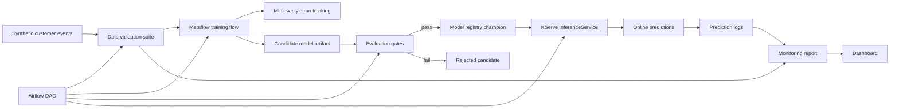

# Kubernetes-Native MLOps Platform

[](https://github.com/kevinmeix1/advanced-kubernetes-mlops-platform/actions/workflows/ci.yml)

A production-style MLOps portfolio project that demonstrates reproducible training, evaluation gates, model registry workflows, KServe-style deployment, rollback, and model observability.

The default demo is local-first and dependency-light so reviewers can run it quickly. The repository also includes integration scaffolding for Metaflow, Airflow, MLflow, Minikube, KServe, Prometheus, and Grafana.


## What This Demonstrates

- Deterministic train, validation, and test split
- Data validation before training
- Metaflow-style training flow
- Airflow DAG for scheduled orchestration
- MLflow-style experiment and registry artifacts
- Automated evaluation gates for accuracy, F1, calibration, segment gap, and latency
- Champion model promotion only when gates pass
- KServe InferenceService manifests for champion and canary serving
- Local serving state that mirrors KServe deployment metadata
- Structured prediction logs
- Model health checks
- Feature drift, prediction drift, latency, error rate, and throughput monitoring
- Rollback command and failure recovery runbook

## Architecture



## Quick Start

```bash
make demo
make test
```

The demo generates a synthetic churn dataset, validates it, trains a deterministic logistic model, logs MLflow-style metadata, evaluates promotion gates, deploys the champion model, writes prediction logs, creates a monitoring report, and renders an HTML dashboard.

Open the dashboard after `make demo`:

```bash
open .local/reports/mlops_platform_dashboard.html
```

## Commands

```bash
make train        # generate data, validate, train, log a candidate
make evaluate     # run promotion gates and promote a champion if gates pass
make deploy       # write local KServe-style deployment state
make predict      # run one online prediction
make monitor      # build drift, latency, and serving observability report
make rollback     # restore previous champion if one exists
make health       # show current serving health
make minikube-up  # print Minikube and KServe bootstrap commands
make test         # run unit and integration tests
```

## Repository Map

- `src/kube_mlops_platform/` - local platform implementation
- `metaflow_flows/` - Metaflow training flow sketch
- `airflow/dags/` - Airflow orchestration DAG
- `kserve/` - KServe champion and canary InferenceService manifests
- `monitoring/` - Prometheus and Grafana scaffolding
- `contracts/` - feature and training data contracts
- `docs/` - architecture notes, runbook, ADRs, and screenshots
- `tests/` - regression tests for lifecycle behavior
- `.github/workflows/ci.yml` - demo and test workflow for GitHub Actions

## Production-Grade Refinements

See [production-grade refinements](docs/production-grade-refinements.md) for the Kubernetes, Airflow, KServe, registry, rollback, and monitoring improvements that make this more than a toy demo.

For the latest heavyweight orchestration pass, see [advanced orchestration assessment](docs/advanced-orchestration-assessment.md).

For the Kubernetes/Airflow robustness layer, see [Kubernetes and Airflow robustness](docs/kubernetes-airflow-robustness.md).

For the operator-facing release planner, see [advanced control plane layer](docs/control-plane-depth.md).

For Airflow 3 release queue, candidate registration, canary readiness, and rollback Deadline Alerts with bounded callbacks, see [Airflow deadline alerts](docs/airflow-deadline-alerts.md).

For OpenCost exporter metrics, Prometheus budget alerts, GPU spend attribution, and allocation labels, see [cost observability and FinOps](docs/cost-observability.md).

For the policy-as-code audit layer, see [security and governance](docs/security-governance.md).

For OpenTelemetry-style runtime traces, see [observability and tracing](docs/observability-tracing.md).

For controlled failure injection and recovery objectives, see [resilience and chaos drills](docs/resilience-chaos.md).

For workload right-sizing, HPA/VPA guardrails, and Airflow pool sizing, see [resource optimization](docs/resource-optimization.md).

For runtime network boundaries, mTLS, and allow-listed service flows, see [network security](docs/network-security.md).

For auditable environment promotion with Argo CD and Argo Rollouts, see [GitOps promotion](docs/gitops-promotion.md).

For backup schedules, restore order, and RPO/RTO evidence, see [disaster recovery](docs/disaster-recovery.md).

For model cards, data cards, risk records, approval evidence, and reproducibility hashes, see [governance evidence](docs/governance-evidence.md).

For multi-window burn alerts, error-budget reports, and release-freeze automation, see [SLO and error budget automation](docs/slo-error-budget.md).

For EKS Auto Mode, Terraform, managed-service mappings, and portability notes, see [cloud migration](docs/cloud-migration.md).

For GitHub artifact attestations, SLSA provenance, Sigstore policy-controller admission, and checksum evidence, see [supply chain provenance](docs/supply-chain-provenance.md).

For an automated scan of advanced Airflow, Kubernetes, lineage, scaling, GitOps, and security controls, see [orchestration scorecard](docs/orchestration-scorecard.md).

For GPU ResourceFlavors, Dynamic Resource Allocation notes, MIG/time-slicing trade-offs, and accelerator quota planning, see [accelerator scheduling](docs/accelerator-scheduling.md).

For DRA `DeviceClass`, `ResourceClaimTemplate`, Kueue admission coupling, and accelerator fallback policy, see [dynamic resource allocation](docs/dynamic-resource-allocation.md).

For Kueue topology-aware placement, topology spread constraints, and rack/zone scheduling trade-offs, see [topology-aware scheduling](docs/topology-aware-scheduling.md).

For KubeRay `RayJob` fanout, elastic worker bounds, Kueue admission, and Airflow-controlled release analysis, see [KubeRay and Kueue](docs/kuberay-kueue.md).

For Kueue Workload Slices, JobSet elastic release training, replacement scoring slices, and rollback quota recovery, see [Kueue elastic workloads](docs/kueue-elastic-workloads.md).

For Kubernetes Indexed Jobs, per-index retry budgets, `successPolicy`, `podFailurePolicy`, and Airflow 3 failed-only release recovery, see [indexed job resilience](docs/indexed-job-resilience.md).

For Kueue ProvisioningRequest admission checks, physical autoscaler capacity guarantees, retry backoff, and release freeze semantics, see [provisioning admission](docs/provisioning-admission.md).

For Kueue MultiKueue manager-to-worker release dispatch, worker status sync, candidate freeze semantics, and rollback-smoke protection, see [MultiKueue dispatch](docs/multikueue-dispatch.md).

For KServe LocalModelCache, modelcar OCI artifacts, promotion cache gates, and rollback preloading, see [release model cache](docs/model-cache.md).

For Airflow 3 GitDagBundle configuration, DAG versioning, scheduler-managed backfills, and incident replay semantics, see [Airflow DAG Bundles](docs/airflow-dag-bundles.md).

For Airflow 3 AssetWatchers, `BaseEventTrigger` contracts, shared-stream polling, `AssetAlias`, and conditional release asset expressions, see [event-driven assets](docs/event-driven-assets.md).

For Kubernetes pod-level resource envelopes, stable scheduling gates, DRA fit checks, and scheduler-churn metrics, see [pod resource envelopes](docs/pod-resource-envelopes.md).

For model-aware routing with Gateway API Inference Extension, stable `InferencePool`, Endpoint Picker fallback, and churn scoring priorities, see [Gateway API Inference Extension](docs/inference-gateway.md).

For release, MLflow, KServe, Kubernetes, and SLO telemetry attributes with prediction payload redaction, see [semantic telemetry contract](docs/semantic-telemetry.md).

For namespace quotas, Kueue cohorts, Airflow tenant pools, chargeback labels, and noisy-neighbor controls, see [multi-tenant fairness](docs/multi-tenant-fairness.md).

For projected service-account tokens, External Secrets, SPIFFE identities, and keyless Airflow task access, see [workload identity](docs/workload-identity.md).

For latency, training-runtime, queue-wait, artifact-size, and quality regression gates, see [performance budgets](docs/performance-budgets.md).

For Kueue quota pressure, Airflow pool slots, priority, preemption, and pending workload examples, see [queue capacity simulation](docs/queue-capacity-simulation.md).

For fail-closed promotion decisions that combine SLOs, queue admission, governance, provenance, and rollout state, see [release admission control](docs/release-admission-control.md).

## Promotion Gates

Promotion requires every gate to pass:

- data validation passed
- accuracy >= 0.70
- F1 >= 0.62
- Brier score <= 0.24
- segment accuracy gap <= 0.18
- p95 latency <= 50 ms

These gates intentionally combine model quality, calibration, segment performance, and serving performance. A candidate can be registered without being promoted.

## Local To Production Mapping

| Local artifact | Production analogue |
| --- | --- |
| `src/kube_mlops_platform/model.py` | training package or reusable model library |
| `.local/mlruns/` | MLflow tracking server and artifact store |
| `.local/registry/` | MLflow Model Registry |
| `.local/deployments/kserve_state.json` | KServe InferenceService status |
| `.local/logs/predictions.jsonl` | online inference logs in object storage or log warehouse |
| `.local/reports/monitoring_report.json` | Evidently, Prometheus, OpenTelemetry, or custom monitors |
| `airflow/dags/kubernetes_mlops_dag.py` | scheduled training and deployment orchestration |
| `metaflow_flows/train_churn_flow.py` | step-based training flow with artifacts and retries |

## Minikube And KServe Path

The repo does not require a Kubernetes cluster for the default demo. To move toward a real local cluster:

```bash
make minikube-up
```

Then install KServe and apply the manifests under `kserve/`. The intended production path is:

1. Train and register the candidate model.
2. Export the champion model artifact to PVC, S3, GCS, or Azure Blob.
3. Update `storageUri` in `kserve/inferenceservice.yaml`.
4. Apply the manifest in the `mlops` namespace.
5. Scrape serving metrics with Prometheus and visualize them in Grafana.

## Why This Is Hard In Production

Model lifecycle systems fail at the boundaries: training data can drift, model versions can be promoted too casually, online serving may load the wrong version, and rollback is often improvised under pressure. This project makes those boundaries explicit:

- training is deterministic and config-like
- gates stop weak candidates from becoming champions
- deployment state records the model version in use
- predictions are structured and traceable
- monitoring separates feature drift from prediction drift
- rollback is a first-class command

## Interview Talking Points

- How would you replace the local registry with MLflow Model Registry?
- Why use F1 and Brier score for churn instead of accuracy alone?
- How would you enforce the same feature contract in training and serving?
- What changes when KServe autoscaling introduces cold starts?
- How would you handle champion/challenger rollout and rollback?
- What should alert immediately versus appear in a daily monitoring report?
