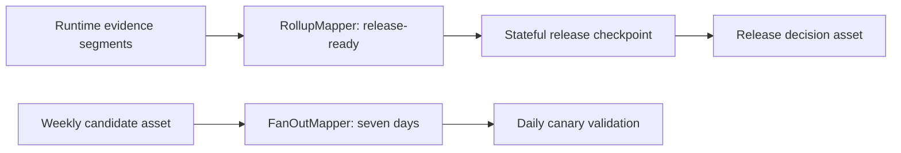

# Airflow 3.3 Stateful Release Orchestration

This refinement uses Airflow 3.3 state stores, partition mappers, runtime partitioning, and exception-aware retry policies for release workflows. The DAG module is parsed in CI against `apache-airflow==3.3.0`; it is not presented as a running Airflow deployment.

## Implemented Evidence

- `airflow/dags/airflow33_stateful_release_dag.py` contains executable public-SDK DAG definitions.
- `tools/validate_airflow33_dag.py` imports the module, checks expected DAG IDs, calls `DAG.validate()`, and rejects empty DAGs.
- GitHub Actions installs Airflow with the official Python 3.11 constraints and runs `pip check` before parsing.
- `make airflow-stateful-orchestration` generates the decision record used by the evidence index.



## State Boundaries

| Mechanism | Scope | Stored here | Deliberately excluded |
| --- | --- | --- | --- |
| Task state store | One task instance and map index | release operation ID, retry progress | model binaries, evaluation reports |
| Asset state store | Release decision asset across runs | candidate digest, last operation ID | secrets, mutable configuration |
| XCom | One DAG run | small task return values | retry-survival state |

The operation ID uses `NEVER_EXPIRE` because duplicate external submissions are worse than retaining a small identifier. Progress uses normal retention. Large evidence remains in object storage and is referenced by digest.

## Failure Semantics

- `ConnectionError` is retryable with bounded attempts and delay.
- `PermissionError` fails immediately because retries cannot repair authorization.
- A worker retry reads `release_operation_id` and reattaches to the existing operation.
- Runtime-discovered evidence partitions are idempotent and duplicate keys collapse at the asset-event layer.
- Fanout is capped at seven daily canary runs; release rollup can create only one downstream run.

## Verification

```bash
make airflow-stateful-orchestration
make airflow-sdk-contract
```

The second command requires the `airflow33` optional dependency. CI is authoritative because it installs Airflow using the release constraints file.

## Production Boundary

The default demo does not run an API server, scheduler, triggerer, workers, or metadata database. A real rollout would also test state retention and garbage collection, scheduler recovery, custom state-store backends, object-store failures, and Kubernetes/registry side effects in an integration cluster.

References: [state-store overview](https://airflow.apache.org/docs/apache-airflow/stable/core-concepts/task-and-asset-state-store.html), [asset partitioning](https://airflow.apache.org/docs/apache-airflow/stable/authoring-and-scheduling/assets.html), [retry policies](https://airflow.apache.org/docs/apache-airflow/stable/core-concepts/tasks.html#retry-policies), and [constrained installation](https://airflow.apache.org/docs/apache-airflow/stable/installation/installing-from-pypi.html).
