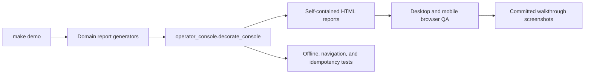

# KubeOps Operator Console

The generated UI is an offline operator console, not a marketing dashboard. Its job is to let a platform engineer move from release state to evidence, failure drills, signal topology, and raw artifacts without changing mental models between pages.

## Design contract

- **Identity:** KubeOps uses graphite, control-plane green, infrastructure blue, and warning amber. Color communicates state or ownership; it is not decoration.
- **Shape:** panels are matte, square-edged, and separated by rules. Metric cells share a single frame instead of floating as unrelated cards.
- **Density:** tables and evidence lists use compact operational spacing. The first viewport answers “what is running, what is blocked, and why?”
- **Language:** the app speaks to an operator. Portfolio and interview guidance lives in documentation, not in runtime screens.
- **Offline behavior:** CSS and Lucide-derived SVG icons are embedded by Python. Generated reports have no CDN, framework, tracking, or font dependency.
- **Accessibility:** the shell provides a skip link, landmark navigation, `aria-current`, focus-visible states, reduced-motion handling, and a tested mobile navigation mode.

## Information architecture

| Surface | Operational question |
| --- | --- |
| Control plane | Can this release advance, and which gate owns the decision? |
| Review cockpit | Is the evidence set complete enough for an operational sign-off? |
| Failure drill | Can the team detect, contain, recover, and preserve evidence? |
| Signal topology | How do Airflow assets, OTel signals, Kueue admission, and SLO burn connect? |
| Demo runbook | What is the timed sequence for reviewing a generated run? |
| Evidence registry | Which immutable report supports each claim? |

## Open-source references

The implementation is original and keeps its own CSS. It uses mature open-source systems as design references:

- [Tabler](https://docs.tabler.io/) (MIT) for application-shell anatomy and compact operational components.
- [PatternFly dashboard guidance](https://v5-archive.patternfly.org/patterns/dashboard/design-guidelines/) and [table guidance](https://v4-archive.patternfly.org/v4/components/table/design-guidelines/) for operator-first hierarchy and dense tabular evidence.
- [Grafana dashboard guidance](https://grafana.com/docs/grafana/latest/visualizations/dashboards/build-dashboards/best-practices/) for constrained panels and documented dashboard intent.
- [Lucide](https://github.com/lucide-icons/lucide) (ISC) for the inline navigation and refresh icon paths.

No upstream template CSS or JavaScript is shipped. This avoids a generic admin-template appearance and keeps the generated evidence portable.

## Review checklist

1. Run `make demo` and open `.local/reports/mlops_platform_dashboard.html`.
2. Verify all six navigation destinations preserve the shell and active state.
3. Check desktop at 1440px and mobile at 390px; the page must have no horizontal document overflow.
4. Confirm status is never encoded by color alone and interactive controls retain visible focus.
5. Regenerate the six `study-*` screenshots after any layout or copy change.
