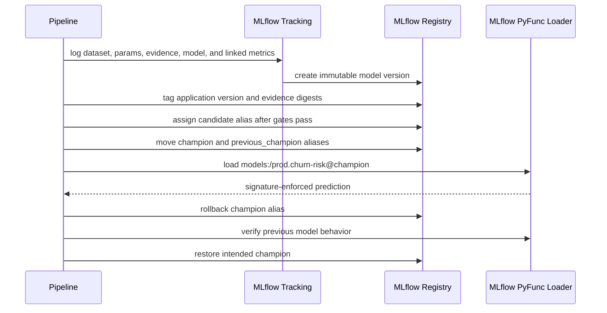

# Executable MLflow Registry

## Purpose

The default lifecycle uses local JSON files because it is quick to inspect. The
MLflow contract exists to prove that the same promotion rules work against the
real MLflow 3 tracking and registry APIs.

## Executed Flow

## Identity And Idempotency

MLflow registry versions are monotonically assigned integers. They are not the
same as the application model version. The contract therefore stores:

- `application.version`
- `artifact.sha256`
- `gate.sha256`
- `source.run_id`
- `validation.status`
- `feature.contract`

Publishing an existing application version with the same artifact and gate
digests returns the existing registry version. Reusing the application version
with different evidence fails before a new run or model version is created.

## Model Packaging

The candidate is logged with MLflow model-from-code. The model configuration is
an artifact loaded by the code model. This avoids serializing the executable
model object with CloudPickle and produces an explicit input/output signature:

- five required numeric features
- one required segment string
- a churn score and integer prediction

The contract loads the champion by alias and compares its score with the local
model implementation to detect packaging or preprocessing divergence.

## Dataset And Metric Lineage

The deterministic training split is logged as an MLflow dataset input. Metrics
are linked to both the dataset and the logged model ID using MLflow 3 APIs. The
report retains the dataset digest, logged model ID, source run ID, and registry
version so a reviewer can trace a deployment decision back to evidence.

## Promotion And Rollback

`candidate` is assigned only when every local gate passes. Promotion moves the
current `champion` to `previous_champion`, then points `champion` at the approved
version. Rollback swaps those aliases, loads the previous model, and proves that
its score matches the earlier local model. The contract then restores the newer
champion and verifies parity again.

These are multiple MLflow API operations, not a database transaction. A
production controller must serialize promotion operations, persist an operation
ID, reconcile partial failures, and require an approval policy before the first
alias mutation.

## Storage Modes

| Mode | Metadata | Artifacts | Purpose |
| --- | --- | --- | --- |
| Local contract | SQLite | local filesystem | fast executable integration test |
| Compose contract | SQLite named volume | proxied local named volume | real HTTP and container boundary |
| Production mapping | PostgreSQL or managed SQL | versioned object storage | multi-replica service and durable retention |

The Compose server uses one worker because SQLite is a single-node boundary.
Horizontal scaling requires an external relational database and shared artifact
storage.

## Metrics Contract

`make compose-smoke` validates the exporter family that MLflow itself exposes:
`mlflow_exporter_info` with the pinned exporter version. It does not assume the
presence of generic `process_*` collectors, because those are not part of
MLflow's multiprocess exporter contract. The resulting
`mlflow_server_metrics_contract.json` report is uploaded with the registry
evidence in CI.

## Security Boundary

The local server configures explicit allowed hosts, explicit CORS origins, a
non-root user, a read-only root filesystem, dropped Linux capabilities, and
bounded resources. It intentionally does not claim user authentication. A team
deployment must add TLS, SSO or MLflow authentication, workspace/resource RBAC,
secret management, backup, and audit retention.
