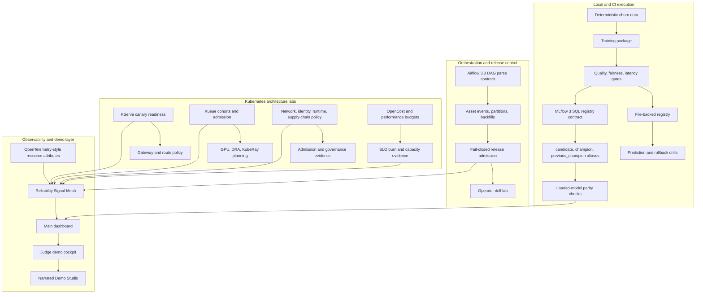

# Study Guide: Kubernetes-Native MLOps Platform

This guide is the reviewer path for understanding the whole project. It explains what runs locally, what is a Kubernetes architecture lab, how the artifacts fit together, and how to talk about the design in an interview.

## Full Architecture



The important boundary: the solid local path proves model lifecycle behavior and registry semantics. The Kubernetes files are deployable reference assets and deterministic planning reports; they are not presented as a hidden live cluster.

## Screenshot Walkthrough

Fresh full-page captures from the generated app are available as a linear demo path:

| Step | Screenshot | What it proves |
| --- | --- | --- |
| 0 | `docs/screenshots/study-00-artifact-index.png` | The generated artifact index gives reviewers one launch point. |
| 1 | `docs/screenshots/study-01-main-dashboard.png` | The main MLOps lifecycle dashboard is readable end to end. |
| 2 | `docs/screenshots/study-02-judge-cockpit.png` | The portfolio cockpit groups evidence by reviewer intent. |
| 3 | `docs/screenshots/study-03-operator-drill.png` | Failure recovery is rehearsed as an operator workflow. |
| 4 | `docs/screenshots/study-04-reliability-signal-mesh.png` | Cross-system reliability signals are connected before release. |
| 5 | `docs/screenshots/study-05-narrated-demo-studio.png` | The narration and video plan can be reviewed without running tools. |

1. **Main dashboard**: `docs/screenshots/dashboard.png`
   Inspect the promotion state, model gates, rollback behavior, drift signal, and generated evidence links. This is the fastest way to see that the project has a working local lifecycle.

2. **Judge demo cockpit**: `docs/screenshots/dashboard-judge-cockpit.jpg`
   Use this as the portfolio entry point. It groups the evidence by release, observability, governance, and operator handoff so a reviewer does not need to hunt through files.

3. **Evidence deck**: `docs/screenshots/dashboard-evidence-deck.png`
   Shows the artifact bundle as a decision packet: registry reports, gate summaries, SLO reports, security evidence, and migration notes.

4. **Operator drill lab**: `docs/screenshots/dashboard-operator-drill.png`
   Demonstrates how an unsafe release is detected, held, explained, and recovered. This is the senior signal: the project does not stop at a happy path.

5. **Reliability Signal Mesh**: `docs/screenshots/dashboard-reliability-signal-mesh.png`
   Connects Airflow assets, OpenTelemetry resource attributes, Kueue pressure, SLO burn, and release admission into one operational graph.

6. **Narrated Demo Studio**: `docs/screenshots/dashboard-narrated-demo-studio.png`
   Provides a timed explanation plan, subtitle file, natural-voice backend options, and Remotion props for turning the evidence into a polished video walkthrough.

7. **KServe canary readiness**: `docs/screenshots/dashboard-kserve-canary-readiness.png`
   Explains field ownership, dry-run apply, and canary analysis gates before a model reaches production traffic.

8. **Kueue admission path lab**: `docs/screenshots/dashboard-admission-path-lab.png`
   Shows preferred flavors, last-acceptable fallback boundaries, and flavor-scoped checks for batch and ML workloads.

9. **Mobile/responsive capture**: `docs/screenshots/dashboard-mobile.png`
   Confirms the demo is presentable in a narrow review window and not only on a developer monitor.

## How To Study The Code

Start with `src/kube_mlops_platform/cli.py`. It wires the deterministic demo into training, validation, release control, observability, Kubernetes planning reports, and dashboard generation. Then read these modules in order:

| Area | Files | What to learn |
| --- | --- | --- |
| Model lifecycle | `model.py`, `gates.py`, `registry.py`, `serving.py` | Gate-protected promotion, deterministic scoring, rollback |
| Real registry contract | `mlflow_runtime.py`, `mlflow_churn_model.py` | MLflow aliases, signatures, model-from-code, parity |
| Release and reliability | `release_admission.py`, `reliability_signal_mesh.py`, `operational_readiness.py` | Fail-closed rollout decisions and evidence packets |
| Kubernetes depth | `kserve_canary_readiness.py`, `cohort_fair_sharing.py`, `dynamic_resource_allocation.py`, `supply_chain.py` | How cluster controls map to model operations |
| Presentation layer | `dashboard.py`, `demo_cockpit.py`, `narrated_demo_studio.py`, `artifact_index.py` | How generated evidence becomes a reviewer-friendly app |

## Commands To Reproduce

```bash
make clean
make demo
make test
make ci-verify
open .local/reports/index.html
open .local/reports/narrated_demo_studio.html
```

For the real MLflow contract:

```bash
make mlflow-contract
make test-mlflow
```

## Interview Talking Points

- **Why local-first?** The project proves lifecycle semantics without cloud credentials, while Kubernetes manifests document the production migration path.
- **Why MLflow aliases instead of stages?** Modern MLflow registry usage favors aliases for champion/candidate rollback and clearer serving contracts.
- **Why fail closed?** A release system should default to hold when drift, SLO burn, missing evidence, or ownership ambiguity appears.
- **Why separate executable evidence from architecture labs?** It prevents exaggerated claims while still showing senior-level design depth.
- **What would change in production?** Replace local JSON/SQLite state with Postgres, use a managed artifact store, run Airflow and KServe on a real cluster, send OTLP to a collector, and enforce policies through admission controllers and GitOps.

## Learning Outcomes

After studying this repository, you should be able to explain model registry promotion, quality gates, rollback, Airflow asset orchestration, Kueue admission, KServe readiness, DRA planning, OpenTelemetry-style evidence, and how to present an MLOps platform credibly without overstating what is running locally.
